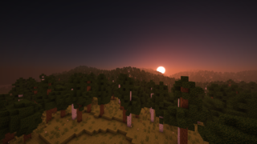
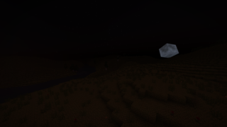
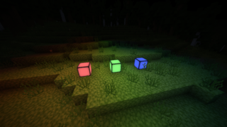
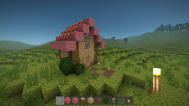

# ChromaForge

## *Воксельный движок, стирающий границы между мечтой и реальностью*

[]

**ChromaForge** — это воксельный движок с открытым исходным кодом, вдохновлённый Minecraft и Hytale.  
Творите, создавайте, вдохновляйте и вдохновляйтесь!

---

## 📸 Скриншоты

---

## 📦 Быстрый старт (Windows)

Скачайте последнюю сборку:

[**ChromaForge-v0.3.0-Windows-x64.zip**](https://github.com/Ezhovnik/ChromaForge-v2/releases/download/v0.3.0/ChromaForge-v.0.3.0-Windows-64-bit.zip)

Распакуйте архив и запустите `ChromaForge.exe`.

---

# Управление по умолчанию

- <kbd>**Esc**</kbd> - пауза
- <kbd>**E**</kbd> - открытие инвенторя
- <kbd>**W**</kbd> <kbd>**A**</kbd> <kbd>**S**</kbd> <kbd>**D**</kbd> - передвижение
- <kbd>**C**</kbd> - приближение
- <kbd>**Space**</kbd> - прыжок
- <kbd>**LMB**</kbd> - разрушить блок
- <kbd>**RMB**</kbd> - поставить блок
- <kbd>**MMB**</kbd> - взять блок
- <kbd>**F**</kbd> - включить/выключить полёт
- <kbd>**N**</kbd> - включить/выключить "режим наблюдателя"
- <kbd>**F1**</kbd> - включить/выключить видимость инвенторя
- <kbd>**F2**</kbd> - сохранить скриншот
- <kbd>**F3**</kbd> - включить/выключить режим отладки
- <kbd>**F4**</kbd> - переключить вид камеры
- <kbd>**F5**</kbd> - перезагрузить чанки
