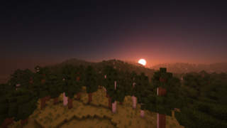
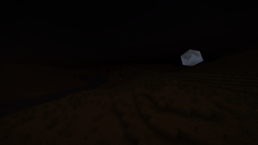
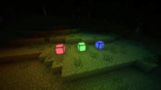
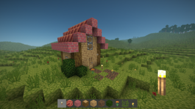

# ChromaForge

[](https://github.com/Ezhovnik/ChromaForge-v2/releases/latest)
[](https://github.com/Ezhovnik/ChromaForge-v2)

**CI/CD:**

- [](https://github.com/Ezhovnik/ChromaForge-v2/actions)
- [](https://github.com/Ezhovnik/ChromaForge-v2/actions)
- [](https://github.com/Ezhovnik/ChromaForge-v2/actions)

Воксельный движок с открытым исходным кодом, вдохновлённый Minecraft и Hytale.

## 📸 Скриншоты

[](doc/screenshots/screenshot1.png)
[](doc/screenshots/screenshot2.png)
[](doc/screenshots/screenshot3.png)
[](doc/screenshots/screenshot4.png)

## 📦 Скачать

[ChromaForge v0.3.0 (Windows)](https://github.com/Ezhovnik/ChromaForge-v2/releases/download/v0.3.0/ChromaForge-v.0.3.0-Windows-64-bit.zip)

Распакуйте архив и запустите `ChromaForge.exe`.

## Сборка проекта

### Windows (Visual Studio + vcpkg)

> [!NOTE]
> Требуется: **vcpkg**, **CMake**, **Git**, **Visual Studio** (с C++ инструментами).

```powershell
git clone https://github.com/Ezhovnik/ChromaForge-v2.git
cd ChromaForge-v2
cmake --preset default-vs-msvc-windows
cmake --build --preset "MSVC Release" --config Release
```

> [!TIP]
> Если vcpkg не установлен: `git clone https://github.com/microsoft/vcpkg.git C:\vcpkg && cd C:\vcpkg && .\bootstrap-vcpkg.bat`
> Установите переменную `VCPKG_ROOT = C:\vcpkg`.

### Windows (MinGW)

> [!NOTE]
> Требуется: **CMake**, **Git**, **MSYS2** с MinGW toolchain.

```powershell
git clone https://github.com/Ezhovnik/ChromaForge-v2.git
cd ChromaForge-v2
cmake --preset default-ninja-mingw-windows -DCMAKE_BUILD_TYPE=Debug
cmake --build --preset "MinGW Debug"
```

### Linux (нативная сборка)

> [!NOTE]
> Требуется: **CMake**, **Git**, **g++**, **pkg-config**.

```sh
# Debian/Ubuntu
sudo apt install libglfw3-dev libglfw3 libglew-dev libopenal-dev \
  libluajit-5.1-dev libvorbis-dev libcurl4-openssl-dev libfmt-dev libspdlog-dev

# EnTT (последняя версия под C++17)
git clone --branch v3.16.0 https://github.com/skypjack/entt.git
cd entt/build
cmake -DCMAKE_BUILD_TYPE=Release -DENTT_INSTALL=ON ..
sudo make install
```

Сборка через `run.sh`:

```sh
chmod +x run.sh
./run.sh --build      # собрать
./run.sh --rebuild    # пересобрать
./run.sh              # собрать и запустить
```

### macOS (Homebrew)

> [!NOTE]
> Требуется: **CMake**, **Git**, **Homebrew**.

```sh
brew install glfw3 glew openal-soft luajit libvorbis skypjack/entt/entt googletest

git clone https://github.com/Ezhovnik/ChromaForge-v2.git
cd ChromaForge-v2
cmake -S . -B build -DCMAKE_BUILD_TYPE=Release
cmake --build build
```

### Docker

> [!NOTE]
> Требуется: **Docker Engine**.

```sh
git clone https://github.com/Ezhovnik/ChromaForge-v2.git
cd ChromaForge-v2
docker build -t chromaforge .
docker run --rm -it -v "$(pwd):/project" chromaforge \
  bash -c "cmake -DCMAKE_BUILD_TYPE=Release -Bbuild && cmake --build build --parallel"
```

> [!TIP]
> Движок поддерживает флаг `--headless` для запуска без графического окна (полезно для CI и тестов).

## Тестирование

Собрать и запустить тесты:

```sh
cmake --build build --target ChromaForge_test
ctest --output-on-failure
```

> [!NOTE]
> Тесты собираются только если включён флаг `ChromaForge_BUILD_TESTS=ON` (включён в пресете `default-vs-msvc-windows`).

## Управление по умолчанию

| Клавиша | Действие |
| ------- | -------- |
| `Esc` | Пауза |
| `E` | Открыть инвентарь |
| `W A S D` | Передвижение |
| `Space` | Прыжок |
| `C` | Приближение |
| `ЛКМ` | Разрушить блок |
| `ПКМ` | Поставить блок |
| `СКМ` | Взять блок |
| `F` | Вкл/выкл полёт |
| `N` | Вкл/выкл режим наблюдателя |
| `F1` | Вкл/выкл видимость инвентаря |
| `F2` | Скриншот |
| `F3` | Вкл/выкл отладку |
| `F4` | Переключить вид камеры |
| `F5` | Перезагрузить чанки |
